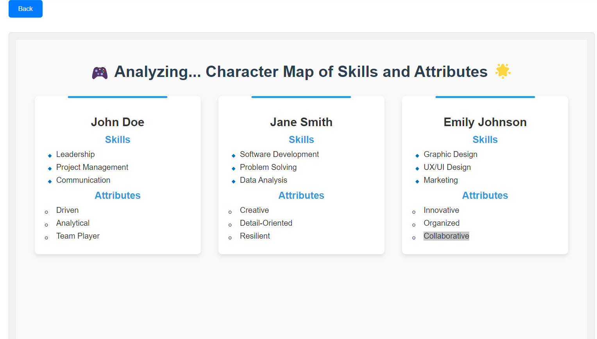

# D-Wikis

### Project Description:
We're building code involved with turning Discord into a powerful search engine for games, RSO information, and much more. With us, you simply type in a topic, and our engine instantly generates a live, dynamic website based on the conversations happening in your Discord servers and channels. No more endless searching – get instant, relevant results from the places where you and your community are already talking.

### Insights:
Every great search engine boasts a host of cool unique features, and so do we! We call these **Insights**—special tools that add fun and useful functionality to elevate your search experience.  
<Insight Image 1>  
<Insight Image 2>

### Website:
Try out our most recent development here: [D-Wikis Website](https://d-wiki.glitch.me/)

|  |   |
|---------------------------------------|------------------------------------------------|
|                                       |   |

### Progress:
We're developing a playful and intuitive UI inspired by Discord and Nintendo's fun user interface style. All to create an environment that is just as enjoyable as it is powerful for every user.

### About Contributions?
We are not currently accepting any new additions to the team, but we are `always` welcoming ideas. 
What feature do you want to see added to `Insights`?  
Message me at nathan37@illinois.edu
